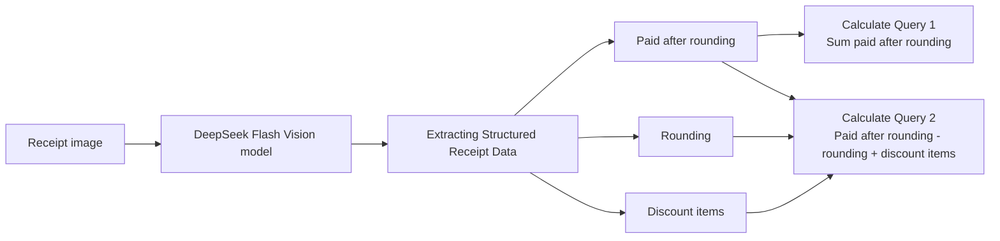

# FTEC5660 Homework 1: Receipt Chain

Build a LangChain pipeline that reads every supermarket receipt in a folder
with the vision-capable DeepSeek Flash model and answers these two questions:

1. How much money did I spend in total for these bills?
2. How much would I have had to pay without the discount?

For this homework, **amount spent** means the final payment after the receipt's
rounding line. **Without the discount** means the sum of the original positive
item prices: add back every promotion, coupon, member, app, packaging-damage,
and percentage discount, but do not add back rounding.

## Student task

Only edit the two functions in `hw1.py` that contain `### YOUR CODE HERE`:

- `build_chain()` creates your LangChain chain.
- `answer_queries()` runs the chain on the receipt images and returns one final
  response for each question.

You may use prompt chaining, routing, parallel calls, reflection, or a
combination. Your final responses should each contain one HKD amount. Do not
hard-code filenames or public answers; grading uses unseen receipt folders.

## Setup and public test

```bash
python3 -m venv .venv
source .venv/bin/activate
pip install -r requirements.txt
```

Put your DeepSeek key after `DEEPSEEK_API_KEY=` in `.env`, then run:

```bash
python3 hw1.py --image-folder public_test
```

The program creates `results.csv` in the current directory. Its columns are
`query`, `model_response`, and `correctness`. The public answers are in
`public_test/ground_truth.json`. The starter intentionally returns the dummy
response `please design your chain to answer these two queries.` so it runs
before you add any API code.

The required model is `deepseek-v4-flash-vision-exp`, the vision-capable
DeepSeek Flash model. JPEG, PNG, GIF, and WebP inputs are accepted by the
homework runner.


## Homework 1 solution: 

### Chain Visualization

### Explanation
To answer Queries 1 and 2, the chain first extracts the required information from each receipt: the amount paid after rounding, the rounding adjustment, and all discount amounts. Because the model may be less reliable when performing arithmetic, I do not ask it to answer the two queries directly. Instead, I ask it to extract the relevant values in a consistent format.

I use `model.with_structured_output()` and define a `ReceiptInfo` class with `pydantic.BaseModel` to specify the expected response format and simplify the subsequent calculations. The model returns one `ReceiptInfo` object for each receipt, with values stored in the `paid_after_rounding`, `rounding`, and `discount_items` attributes. Query 1 is calculated by summing `paid_after_rounding` across all receipts. Query 2 is calculated as `paid_after_rounding - rounding + sum(discount_items)` for each receipt, then summing the results.

